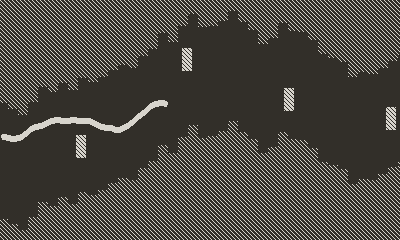

# Worm Playdate
   

This is my worm game for Playdate, initially written for the vircon32 fantasy console, then ported SDL3 and now to Playdate.
It is a remake of the classic copter / worm game with multiple gameplay modes

## Controls Playdate / XBox Controller

| Button      | Action                                        |
|-------------|-----------------------------------------------|
| A or B      | Start GAME, Repeadetly tap to move Worm       |
| LEFT/RIGHT  | Select Game Mode on Titlescreen               |
| UP/DOWN     | Select Level on Titlescreen                   |

## Controls Keyboard

| Key         | Action                                        |
|-------------|-----------------------------------------------|
| SPACE       | Start GAME, Repeadetly tap to move Worm       |
| LEFT/RIGHT  | Select Game Mode on Titlescreen               |
| UP/DOWN     | Select Level on Titlescreen                   |
| F           | Switch Fullscreen / Windowed                  |
| F3          | Reset Game                                    |
| F4          | Quit Game                                     |

## Aim of the game
Repeadetly Press / hold A button to move the worm around, dont hit obstacles and walls, try to gain highest score.

## High Scores
High Scores are only saved for levels 1 to 99 per game mode. If you select rnd2 levels, it will also select levels randomly higher than 99 but those all share a common highscore.
If you want to compete with friends select a level manually to compare scores.

## Seed System
The game has a seed system, you can choose a number between 0 and 99 for the seed.
Selecting Rnd1 will select random levels between 0 and 99 on every (re)start, where highscore is saved for them.
Rnd2 will select also random levels higher than 99 but it will use a common highscore for these levels. This is similar to how it was initially implemented in the SDL3 and Vircon32 port.
It allows you to play random levels different from the fixed 99 ones.

## Game Modes
There are 5 Game modes to play on, each with their own specifics

### Mode A
- decreasing space for the worm to move in
- 5 obstacles
- Constant slower speed

### Mode B
- Fixed space for the worm to move in
- No obstacles
- Increasing speed

### Mode C
- Fixed space for the worm to move in
- 2 obstacles
- Increasing speed 

### Mode D
- Decreasing space for the worm to move in
- No obstacles
- Increasing speed

### Mode E
- Pacman mode: Collect the yellow squares, missing one is game over
- Fixed space for the worm to move in
- No obstacles
- Constant slower speed

## Credits
The game was made possible after watching this youtube movie: [https://www.youtube.com/watch?v=W-3okcjOFnY](https://www.youtube.com/watch?v=W-3okcjOFnY)

## License
* License of my part of game's code is MIT
